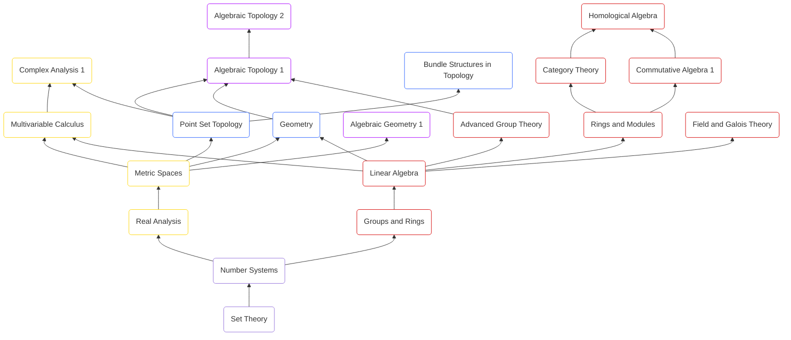

# 📚 Pure Mathematics Notes

A structured collection of **theorems, definitions, and proofs** that I’ve learned in pure mathematics.  
Organized by topic, this repository serves as both a personal reference and a learning resource for others interested in rigorous mathematics. Note that this is an **exposition** - I claim no originality on any of the content. 

It contains my organized notes on key areas of pure mathematics. Some of the topics I covered are included below: 

| Branch | Topics Covered |
|---------|----------------|
| **Foundations** | Set Theory, Number Systems |
| **Algebra** | Groups and Rings, Linear Algebra, Rings and Modules |
| **Analysis** | Real Analysis, Metric Spaces, Multivariable Calculus |
| **Topology & Geometry** | Point Set Topology, Geometry |

---

## 🏗️ Notes Structure

