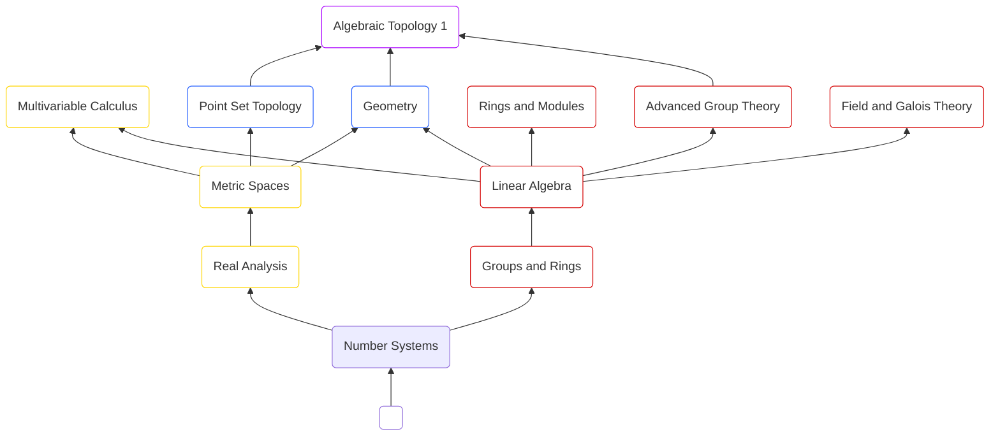

```mermaid
flowchart BT
    A("<a href='[https://github.com/](https://github.com/Labix-Liu/Notes/blob/main/Sets%20and%20Numbers/Set%20Theory/Set%20Theory.pdf)'Set Theory</a>") --> B("Number Systems")
    B --> C("Real Analysis") & D("Groups and Rings")
    C --> E("Metric Spaces")
    D --> F("Linear Algebra")
    E --> G("Multivariable Calculus") & H("Point Set Topology") & I("Geometry")
    F --> G & I & J("Rings and Modules") & K("Advanced Group Theory") & L("Field and Galois Theory")
    H --> M("Algebraic Topology 1")
    I --> M
    K --> M

     A:::None
     C:::Analysis
     D:::Algebra
     E:::Analysis
     F:::Algebra
     G:::Analysis
     H:::Class_01
     H:::TopologyGeometry
     H:::TopGeo
     I:::Class_01
     I:::TopologyGeometry
     I:::TopGeo
     J:::Algebra
     K:::Algebra
     L:::Algebra
     M:::AlgTopGeo
    classDef AlgTopGeo stroke:#AA00FF, fill:#FFFFFF
    classDef TopGeo stroke:#2962FF, fill:#FFFFFF
    classDef Analysis stroke:#FFD600, fill:#FFFFFF
    classDef Algebra stroke:#D50000, fill:#FFFFFF
    classDef None fill:#FFFFFF
```
